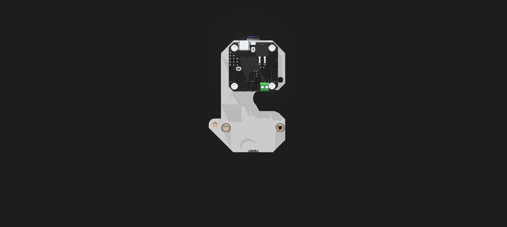

# Vendetta Toolhead Assembly Guide

Welcome to the official assembly guide for the **Vendetta Toolhead**—designed to deliver precision, durability, and undeniable style to your 3D printer setup.

---

## 🔧 Tools & Materials Required

* Allen wrenches (1.5mm to 4mm)
* M3 screws (various lengths)
* Heat inserts
* Soldering iron (for inserts)
* Threadlocker (blue)
* Your full set of Vendetta STLs

---

## 📦 Bill of Materials (STLs)

*All STL files are organized in subfolders within `/models/STLs/`*

### Main Body

* [`main_body_front_enable_supports.stl`](models/STLs/main_body_front/main_body_front_enable_supports.stl)
* [`main_body_rear.stl`](models/STLs/main_body_rear/main_body_rear.stl)

### Cutter Arm

* [`cutter_arm.stl`](models/STLs/cutter_arm/cutter_arm.stl)
* [`cutter_arm_button.stl`](models/STLs/cutter_arm/cutter_arm_button.stl)
* [`cutter_arm_button_v2.stl`](models/STLs/cutter_arm/cutter_arm_button_v2.stl)

### Shroud

* [`shroud.stl`](models/STLs/shroud/shroud.stl)
* [`shroud_fan.stl`](models/STLs/shroud/shroud_fan.stl)
* [`shroud_logo.stl`](models/STLs/shroud/shroud_logo.stl)

### CPAP Adapter

* [`cpap_upper.stl`](models/STLs/cpap/cpap_upper.stl)
* [`cpap_mid_left.stl`](models/STLs/cpap/cpap_mid_left.stl)
* [`cpap_mid_right.stl`](models/STLs/cpap/cpap_mid_right.stl)
* [`cpap_low_left.stl`](models/STLs/cpap/cpap_low_left.stl)
* [`cpap_low_right.stl`](models/STLs/cpap/cpap_low_right.stl)

### Idler

* [`idler_with_supports.stl`](models/STLs/idler/idler_with_supports.stl)

### Fan Duct Covers

* [`Fan_Duct_Covers.stl`](models/STLs/fan_duct_covers/Fan_Duct_Covers.stl)

---

## 🧠 Assembly Overview

The Vendetta Toolhead is a modular, high-performance design tailored for reliability and thermal efficiency.

---

## 🧱 Main Body (Front)

This is the anchor point for many of the subcomponents. Mount it first to establish orientation.

---

## 🧱 Main Body (Rear)

Secures to the front shell, and interfaces with the carriage or gantry mount.

---

## ⚙️ Cutter Arm

Used for fine filament cutting or tool interaction. Ensure precision alignment.

---

## 🌬️ Shroud

Directs airflow and cooling—install with CPAP adapter if using external air assist.

---

## 🫁 CPAP Adapter

Optional component for integrating an external CPAP or high-flow fan.

---

## 🛞 Idler

Tension system for belt or drive alignment.

---

## ✅ Final Assembly Checklist

* [ ] All bolts torqued
* [ ] Threadlocker applied where needed
* [ ] Fan and CPAP tested
* [ ] Belt alignment verified
* [ ] Hotend wired and verified

---

## 📹 Assembly Video

*Coming soon to YouTube — stay tuned!*

---

## 🧠 Notes

* For firmware configurations, PID tuning, and offsets, refer to your printer’s mainboard documentation.
* Contributions welcome. Submit pull requests or file issues as needed.

---

## 🔗 License

MIT License. Build, remix, and share—with attribution.
