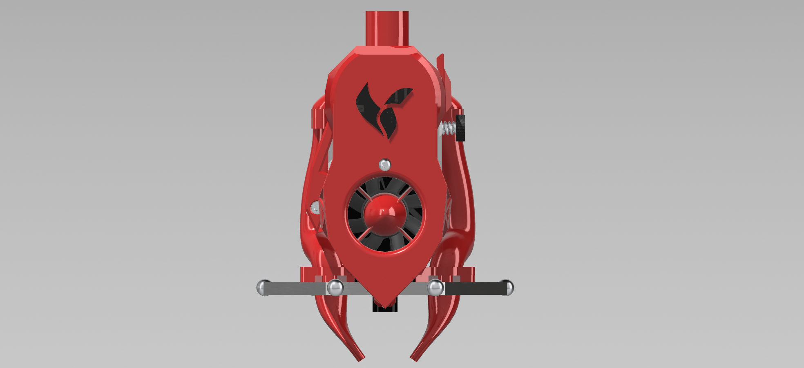
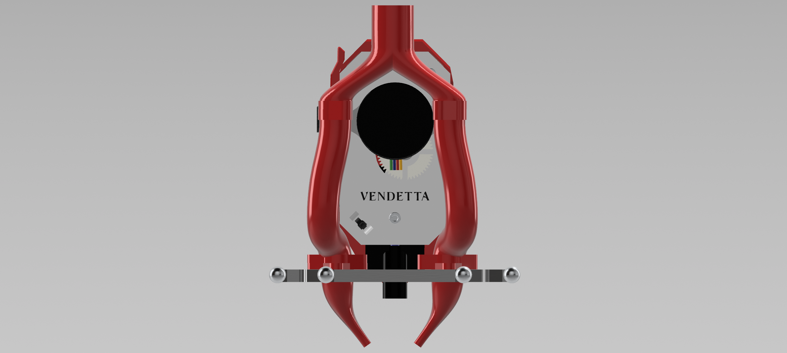
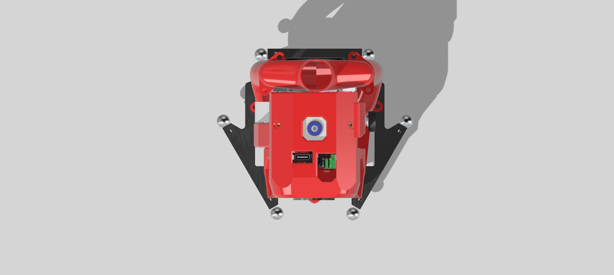
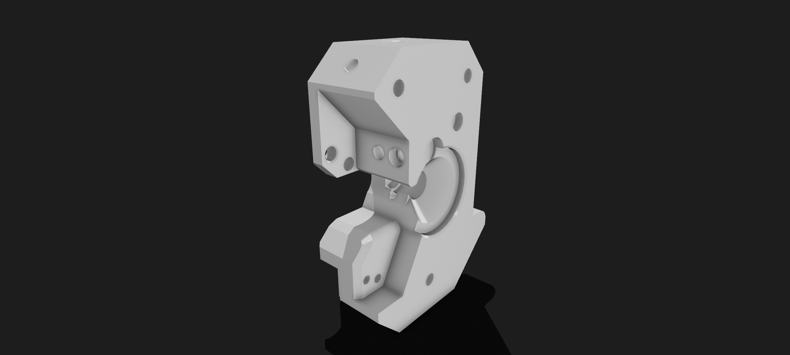
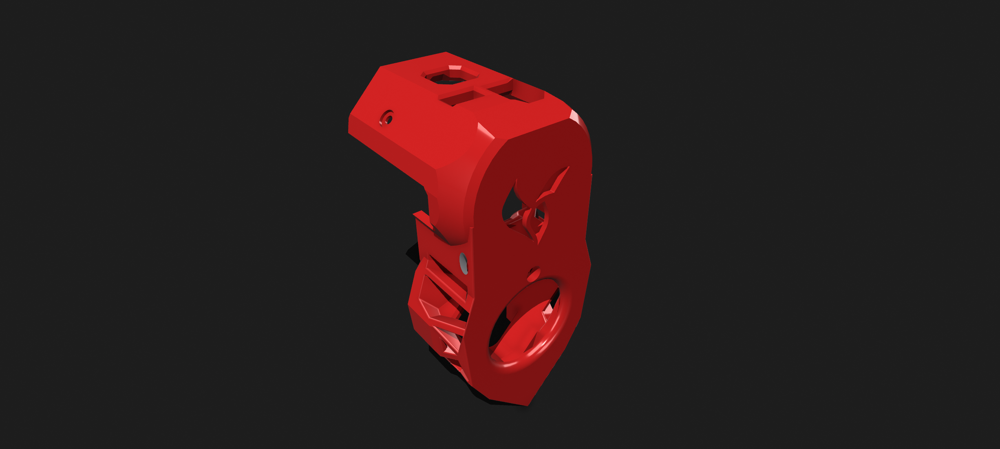
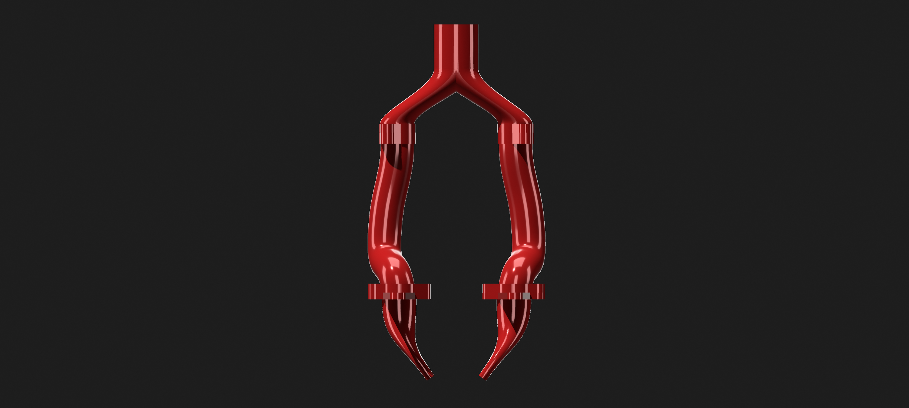

# Vendetta Toolhead Assembly Guide

Welcome to the official assembly guide for the **Vendetta Toolhead**—designed to deliver fully functional ability to use your V400 with Box Turtle!
Fully fuctional toolhead cutting, filament sensors, lighting, Canbus or USB, CPAP or stock cooling.

---

## 🔧 Tools & Materials Required

* Original V400 effector for base parts
* Soldering iron (for inserts)
* [BOM Hardware](assembly/BOM.md)
* Your full set of Vendetta STLs

---

## 📦 Bill of Materials

*All STL files are organized in subfolders within `/models/STLs/`*
### [*Hardware BOM*](assembly/BOM.md)

### Main Body

* [`main_body_front_enable_supports.stl`](models/STLs/main_body_front/main_body_front_enable_supports.stl)
* [`main_body_rear.stl`](models/STLs/main_body_rear/main_body_rear.stl)

### Cutter Arm

* [`cutter_arm.stl`](models/STLs/cutter_arm/cutter_arm.stl)
* [`cutter_arm_button.stl`](models/STLs/cutter_arm/cutter_arm_button.stl)
* [`cutter_arm_button_v2.stl`](models/STLs/cutter_arm/cutter_arm_button_v2.stl)
* [`cutter_arm_mount_cutter_pin.stl`](models/STLs/cutter_arm/cutter_arm_mount_cutter_pin.stl)
* [`cutter_arm_mount_cutter_pin_long.stl`](models/STLs/cutter_arm/cutter_arm_mount_cutter_pin_long.stl)

### Shroud

* [`shroud.stl`](models/STLs/shroud/shroud.stl)
* [`shroud_fan.stl`](models/STLs/shroud/shroud_fan.stl)
* [`shroud_logo.stl`](models/STLs/shroud/shroud_logo.stl)

### CPAP Adapter

* [`cpap_upper.stl`](models/STLs/cpap/cpap_upper.stl)
* [`cpap_mid_left.stl`](models/STLs/cpap/cpap_mid_left.stl)
* [`cpap_mid_right.stl`](models/STLs/cpap/cpap_mid_right.stl)
* [`cpap_low_left.stl`](models/STLs/cpap/cpap_low_left.stl)
* [`cpap_low_right.stl`](models/STLs/cpap/cpap_low_right.stl)

### Idler

* [`idler_with_supports.stl`](models/STLs/idler/idler_with_supports.stl)

### Fan Duct Covers

* [`Fan_Duct_Covers.stl`](models/STLs/fan_duct_covers/Fan_Duct_Covers.stl)

### Misc Add-ons

* [`rear_pillar_brush_indexer.stl`](models/STLs/misc_addons/rear_pillar_brush_indexer.stl)

---

## 🧠 Assembly Overview

The Vendetta Toolhead is a modular, high-performance design tailored for Box Turtle Automated Filament Changer.

---

## 🧱 Main Body (Front)

Secures to the effector via the heatsink. Houses cutting blade, filament sensor, and EBB42.

---

## 🧱 Main Body (Rear)

Secures to the main body front. Mounts the stock stepper for the extruder.

---

## ⚙️ Cutter Arm

Used for filament cutting. Options for cutting your own chisel blades or purchasing bambu cutter blades.

---

## 🌬️ Shroud

Ability to integrate Knomiv2 or strictly run heatbreak fan with nose cone.

---

## 🫁 CPAP Adapter

Optional component for integrating an external CPAP high-flow fan.

---

## 🛞 Idler

Extruder tension arm for filament path.

---

## ✅ Final Assembly Checklist

* [ ] All bolts torqued
* [ ] Threadlocker applied where needed
* [ ] Fan and CPAP tested
* [ ] Belt alignment verified
* [ ] Hotend wired and verified

---

## Firmware Configuration

All firmware configuration files are organized under the [`firmware/config_files/`](firmware/config_files) directory, sorted by hardware and use case. These settings are tailored specifically for the Vendetta tool head and its supporting components.

- **Box Turtle Settings**  
  Configuration optimized for the Box Turtle mod—ensuring smooth integration and reliable performance on supported machines. (`AFC*.cfg` files in `firmware/config_files/`)

- **Octopus Pro**  
  Dedicated configuration files for the BigTreeTech Octopus Pro (H723) board. These files are pre-tuned for compatibility and performance. (`firmware/config_files/octopus_pro_and_vendetta_toolhead/`)  
  *Note: the [Hardware BOM](assembly/BOM.md) lists the Octopus V1.1, but the sample `printer.cfg` is written for the Octopus Pro (H723). If you use a different board, build Klipper for that MCU and double-check the `[mcu]` section and pin assignments.*

- **Vendetta Tool Head**  
  Custom settings specifically for the Vendetta tool head. Includes pin mappings, thermal tuning, and motion tweaks to get the most out of your hardware.

> **Note:** The sample configs are for reference only. They were tested with Klipper v0.13.x (my printer runs v0.13.0-786 as of Oct 2026). Pressure advance, input shaper, and the AFC bowden length (`afc_bowden_length`) and `tool_stn` / `tool_stn_unload` values are specific to my printer and must be tuned for yours.

---

## [📹 Assembly Videos](assembly/Videos.md)

*In Production to YouTube — [YouTube](https://youtube.com/playlist?list=PLWgEg1ho19xm_LMkO39CTWQdfH5PHcdP_&si=Ss74mZV-d5u0i4Tc)*

---

## 🧠 Notes

* For firmware configurations, PID tuning, and offsets, refer to your printer’s mainboard documentation.
* Contributions welcome. Submit pull requests or file issues as needed.

---

## 🔗 License

MIT License. Build, remix, and share—with attribution.
